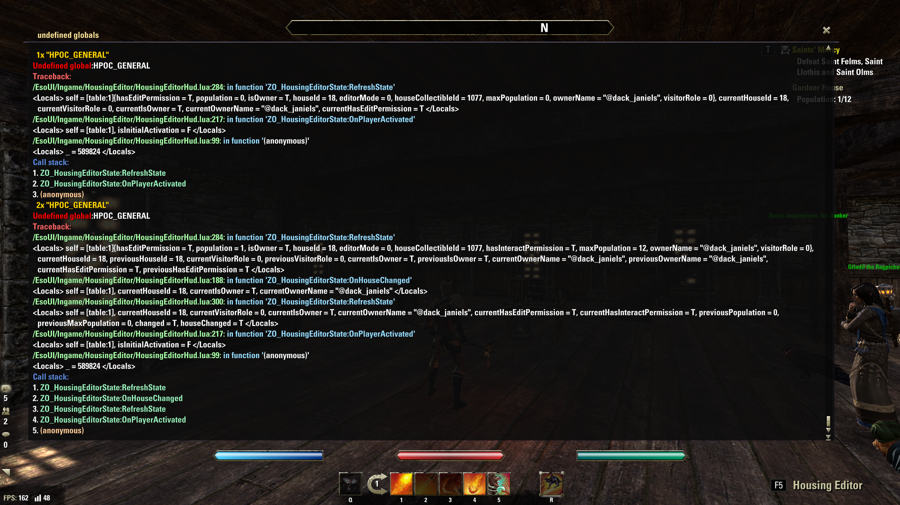

# DacksUndefinedGlobalsCatcher

A powerful debugging utility for ESO (Elder Scrolls Online) add-on developers that helps catch and report undefined global variables. This tool makes it easier to track down pesky UI errors like `attempt to index a nil value` and other issues related to undefined globals in ESO add-ons.

> **Compatible with both PC and Console UI!** Works seamlessly whether you're using keyboard/mouse or gamepad mode.

## Overview

When developing ESO add-ons, one common source of errors is attempting to access undefined global variables. These errors can manifest as cryptic messages like:
```
12345678901234567890:1: attempt to index a nil value
```

DacksUndefinedGlobalsCatcher helps by:
- Catching all attempts to access undefined global variables
- Displaying detailed error information including the variable name and call stack
- Allowing you to ignore specific globals or function patterns
- Providing a convenient UI for reviewing and managing errors

## Screenshots



## Features

- **Real-time Error Detection**: Catches undefined globals as they happen
- **Detailed Error Reporting**: Shows the exact variable that's undefined along with:
  - Call stack with function names
  - Source file and line numbers
  - Local variable context when available
- **Customizable Ignore Lists**:
  - Pre-configured list of common ESO UI elements to reduce noise
  - Add your own globals to ignore via slash commands
  - Add function patterns to ignore via slash commands
- **Interactive UI**:
  - Resizable window with proper scrolling
  - Color-coded messages for better readability
  - Toggle visibility with a simple slash command
- **Multi-platform Support**:
  - Compatible with both keyboard/mouse and gamepad (Console) UI
  - Automatically adapts font and UI elements to the current mode

## Installation

1. Download the latest release from GitHub
2. Extract to your ESO AddOns folder:
   - Windows: `Documents\Elder Scrolls Online\live\AddOns\`
   - Mac: `~/Documents/Elder Scrolls Online/live/AddOns/`
3. Launch ESO and enable the add-on in the add-on settings

## Usage

### Slash Commands

- `/undefs` - Toggle the undefined globals window
- `/undefs_list` - List all ignored globals
- `/undefs_add <name>` - Add a global to the ignore list
- `/undefs_remove <name>` - Remove a global from the ignore list
- `/undefs_listfunc` - List all ignored function patterns
- `/undefs_addfunc <pattern>` - Add a function pattern to the ignore list
- `/undefs_removefunc <pattern>` - Remove a function pattern from the ignore list
- `/undefs_help` - Show help message with all commands
- `/rl` - Shortcut for reloading the UI

### Working with the Error Window

When an undefined global is accessed, it will be displayed in the error window with:
- The number of times it has occurred
- The name of the undefined global
- A detailed call stack showing where the error happened
- When available, local variable context to help debug the issue

### Managing Ignore Lists

The add-on comes with predefined lists of globals and function patterns to ignore. These are common UI elements and functions that don't need to be reported. You can add your own entries to these lists using the slash commands.

#### Default Ignore Lists

To reduce noise, the add-on includes default ignore lists:

**Default Ignored Globals** (over 170 entries) include:
- Common UI elements (`ActionButton1Decoration`, `QuickslotButton5Decoration`, etc.)
- Known addons (`MasterMerchant`, `AdvancedFilters`, `AUI_Main`, etc.)
- Various pin types (`pinType_Skyshards`, `pinType_Treasure_Maps`, etc.)
- ESO global variables (`PREVIEW_UPDATE_INTERVAL_MS`, `TUTORIAL_TRIGGER_MOUNT_SET`, etc.)

**Default Ignored Function Patterns** include:
- UI creation functions (`CreateControl`, `CreateTopLevelWindow`, etc.)
- Event handlers (`OnUpdate`, `OnShow`, `OnHide`, etc.)
- Add-on initialization functions (`OnAddOnLoaded`, etc.)
- Other common patterns (`ZO_WorldMapPins_Manager:AddCustomPin`, etc.)

You can view the complete lists in-game by using the `/undefs_list` and `/undefs_listfunc` commands, or by examining the source code.

## For Add-on Developers

This tool is especially useful when:
- Developing new add-ons
- Debugging existing add-ons
- Finding compatibility issues between add-ons
- Tracking down performance issues caused by repetitive errors

## Credits

- Original concept by Merlight
- Maintained and enhanced by @dack_janiels

## License

DacksUndefinedGlobalsCatcher is not created by, affiliated with, or sponsored by ZeniMax Media Inc. or its affiliates. The Elder Scrolls® and related logos are registered trademarks or trademarks of ZeniMax Media Inc. in the United States and/or other countries. All rights reserved.

## Support & Contributions

If you find a bug or have a feature request, please submit an issue on GitHub. Contributions via pull requests are welcome! 